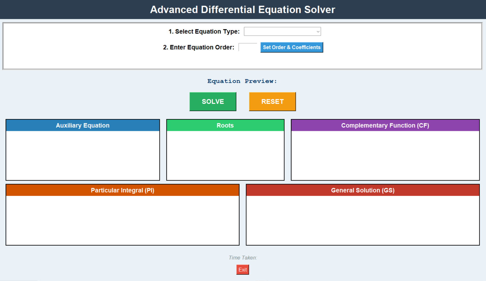

# 🧮 Differential Equation Solver – GUI Application  

> _An interactive full-screen Python tool for solving **nth-order linear ODEs with constant coefficients**, now with new features in `update.py`._

[](https://www.python.org/)  
[](https://www.sympy.org/)  
[](https://docs.python.org/3/library/tkinter.html)  
[](LICENSE)  

---

## 📌 Project Structure

differential-equation-solver/
│
├── main.py                         # Original stable version
├── update.py                       # New features and enhancements
├── general_GUI.png                 # Screenshot of GUI
├── sample_output.png               # Sample equation solution output
├── requirements.txt                # Required packages
└── README.md                       # Project documentation

---

## ⚙️ `main.py` — Original Features

The base version supports:

- ✅ Solves **nth-order linear ODEs with constant coefficients** (up to 6th order)
- ✅ Auto-computes:
  - Auxiliary (characteristic) equation
  - Roots (real, complex, repeated)
  - Complementary function (CF)
- ✅ Displays **time taken** for computation
- ✅ Live equation preview while typing coefficients
- ✅ Real-world applications shown for each equation order
- 🖥️ Full-screen GUI with **`tkinter`**
- 🧠 Symbolic computation via **`sympy`**

---

## ✨ `update.py` — New & Improved Features

- 🔹 **Enhanced Input System**
  - Better coefficient handling with error validation
  - Support for quick clearing and resetting input fields
- 🔹 **Step-by-Step Solution Mode**
  - Shows **derivation of CF** with explanations
  - Highlights root multiplicity in detail
- 🔹 **Extended Output**
  - Adds equation order classification (overdamped, oscillatory, etc.)
  - Displays **root plots** for visual understanding
- 🔹 **UI Improvements**
  - Cleaner font styles and dynamic resizing
  - Option to toggle dark/light mode
- 🔹 **Performance Boost**
  - Optimized symbolic computations for large-order equations

---

## 📷 Screenshots

### Full Old GUI View


### Full New GUI View



### Sample Output
- Old version (main.py)
[View full image](figures/sample_output.png)

- New version (update.py)
[View full image](figures/updated_sample_output.png)

---

## 🧰 Technologies & Concepts

| Domain                 | Tools / Concepts Used                                                                   |
| ---------------------- | --------------------------------------------------------------------------------------- |
| Programming Language   | Python 3                                                                                |
| GUI Toolkit            | `tkinter`                                                                               |
| Symbolic Computation   | `sympy` (including `dsolve`, `sympify`)                                                 |
| **Math Foundation** | Linear ODEs, Method of Undetermined Coefficients, **Cauchy-Euler Equations**, CF, **PI**, **GS** |
| **Development Practice** | Modular design, **Event-driven programming**, **Dynamic UI generation**, Error handling |

---

## ▶️ Getting Started

### ✅ Prerequisites
- Python 3.8 or higher
- A virtual environment (e.g., `venv` or `conda`) is highly recommended.

### 🔧 Installation
1.  **Clone this repository**:
    ```bash
    git clone [https://github.com/Sanjaykumar030/DiffEqnSolver.git](https://github.com/Sanjaykumar030/DiffEqnSolver.git)
    cd DiffEqnSolver
    ```
2.  **Install dependencies:**
    ```bash
    pip install -r requirements.txt
    ```
3.  **Run the application:**
    ```bash
    python update.py
    ```
---

## 🧠 Educational Value

The `update.py` version transforms this tool into a comprehensive learning environment. It reinforces:
- The structural differences between Homogeneous, Non-Homogeneous, and Cauchy-Euler equations.
- The concept of the complete solution ($y = y_c + y_p$).
- How the form of $f(x)$ influences the Particular Integral.
- The application of advanced solving techniques in a transparent, visual manner.

---

## ⚠️ Limitations (in `update.py`)

- The non-homogeneous solver's effectiveness depends on `sympy`'s ability to solve for the PI, which is powerful but may not cover every esoteric function.
- Currently does not solve systems of ODEs or equations with variable coefficients beyond the Cauchy-Euler form.
- Non-linear equations are not supported.

---

## 📜 License
This project is licensed under the MIT License.
See the [LICENSE](LICENSE) file for usage rights and permissions.

---

## 🙋 Author
**Sanjay Kumar Sakamuri Kamalakar**
- 📧 Email: [sksanjaykumar010307@gmail.com](mailto:sksanjaykumar010307@gmail.com)
- 🔗 LinkedIn: [linkedin.com/in/sanjay-kumar-sakamuri-kamalakar-a67148214](https://linkedin.com/in/sanjay-kumar-sakamuri-kamalakar-a67148214)
- 🧪 ORCID: [0009-0009-1021-2297](https://orcid.org/0009-0009-1021-2297)

---

## 🙏 Acknowledgements
- OpenAI’s ChatGPT for architectural and code logic support in the `update.py` refactor.
- The developers and communities behind Python, tkinter, and sympy.
