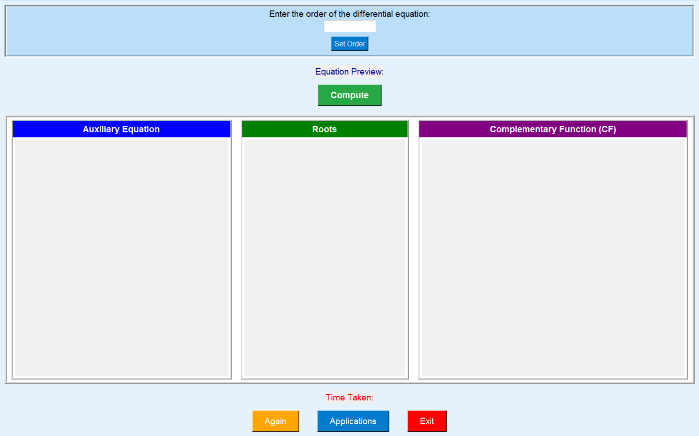

# 🧮 Differential Equation Solver - GUI App

A full-screen GUI application to solve linear ordinary differential equations (ODEs) with constant coefficients.  
Built using Python with `tkinter` for the user interface and `sympy` for symbolic math computations.

---

## ✨ Features

- Solve nth order linear differential equations with constant coefficients  
- Displays:  
  - Auxiliary equation  
  - Roots of the characteristic equation  
  - Complementary function (CF)  
  - Computation time  
- Real-time equation preview while entering coefficients  
- Shows real-world applications based on the equation order  
- Clean, intuitive full-screen GUI

---

## 📚 Technologies & Concepts Used

- Python 3  
- `tkinter` for GUI  
- `sympy` for symbolic mathematics  
- Calculus & Linear Algebra concepts  
- Code and logic assistance from ChatGPT
 
## 📷 Screenshots

### General GUI


- Sample output
  - [View Sample Output Image](sample_output.png)


---
## ▶️ How to Run

1. Make sure Python 3 is installed: [python.org](https://python.org)  
2. Install dependencies:
   ```bash
   pip install sympy
   ---

## 💡 Inspiration

This project was inspired by concepts learned in my Semester 1 Calculus and Linear Algebra courses.


## License

This project is licensed under the MIT License. See the [LICENSE](LICENSE) file for details.
---

## 👤 Author

Sanjay Kumar Sakamuri Kamalakar

---

## 🙏 Acknowledgements

- Thanks to ChatGPT for assistance with code logic and README formatting.
- Thanks to the developers of Python, tkinter, and sympy libraries.
---

## 📫 Contact

Feel free to reach out to me:

- Email: [sksanjaykumar010307@gmail.com](mailto:sksanjaykumar010307@gmail)
- LinkedIn: [Sanjay Kumar Sakamuri Kamalakar](www.linkedin.com/in/sanjay-kumar-sakamuri-kamalakar-a67148214)
---

## 📝 Final Note
This program can be used to solve your problem on Roots, Auxiliary Equation and Complementary Function upto comfortably order 6.
Make use of the solver to crack your differential Equation

Happy solving! 🚀

